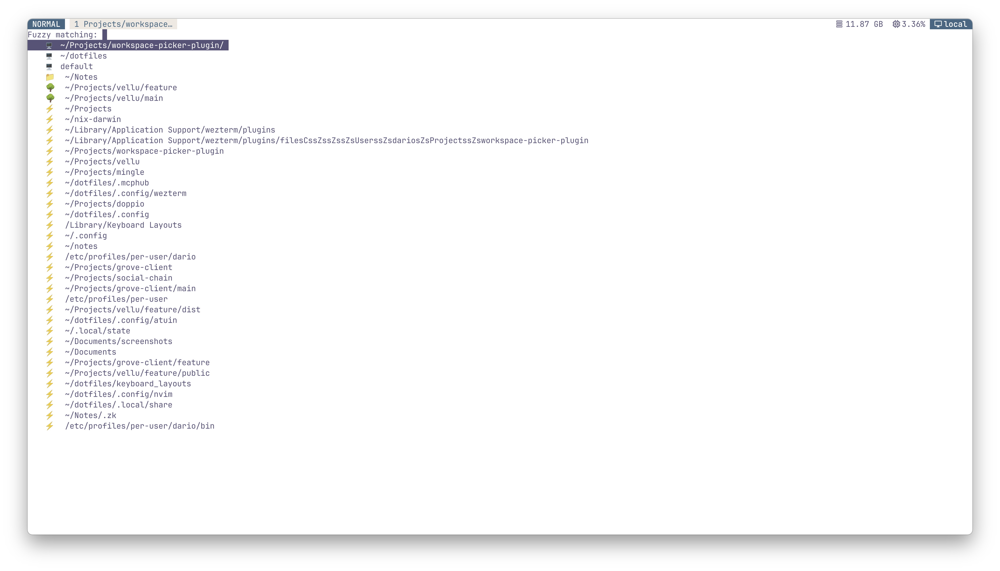

# Workspace Picker Plugin for Wezterm

A comprehensive workspace switcher plugin for [WezTerm](https://wezfurlong.org/wezterm/) that integrates with static workspace configurations, Git worktrees, Zoxide directory tracking, and existing WezTerm workspaces.

## Preview



## Features

- 🔍 **Fuzzy Search**: Quickly find and switch between workspaces
- 🌳 **Git Worktree Support**: Integration of git worktrees (see examples below)
- ⚡ **Zoxide Integration**: Access frequently visited directories
- 🖥️ **Existing Workspace Support**: Switch between active WezTerm workspaces
- 🎨 **Custom Pane Layouts**: Define complex tab and pane configurations
- ⌨️ **Keyboard Shortcuts**: Bind to custom key combinations

## Usage

### Basic Setup

There are two main types of projects: "directory" and "worktreeroot".
When chosing worktreeroot, make sure that the git repository at this path actually contains git worktrees. By picking "worktreeroot" you ensure two things:

1. all git worktrees are listed in the picker
1. the specified tabs/panes layout will be used for all the available worktrees.

```lua
local workspace_switcher = wezterm.plugin.require("https://github.com/bugii/workspace-picker-plugin")

-- Configure workspaces
workspace_switcher.setup({
  { path = "~/projects/my-project", type = "directory" },
  { path = "~/projects/worktrees", type = "worktreeroot" },
})

-- Apply default keybinding (LEADER + f)
workspace_picker.apply_to_config(config)
```

### Advanced Configuration

```lua
local workspace_switcher = wezterm.plugin.require("https://github.com/bugii/workspace-picker-plugin")

workspace_switcher.setup({
  -- Static directory
  {
    path = "~/dotfiles",
    tabs = {
      { name = "editor", panes = { { command = "vim" } } },
      { name = "terminal" },
    }
  },

  -- Git worktree root
  {
    path = "~/Projects/my-repo.git",
    type = "worktreeroot",
    tabs = {
      {
        name = "development",
        direction = "Bottom",
        panes = {
          { command = "vim" },
          {
            direction = "Right",
            panes = {
              { command = "npm run dev" },
              { command = "npm run test" }
            }
          }
        }
      }
    }
  }
}, {
  icons = {
    directory = "📁",
    worktree = "🌳",
    zoxide = "⚡",
    workspace = "🖥️",
  }
})

-- Apply to config with custom keybinding
workspace_picker.apply_to_config(config, "f", "CTRL")
```

### Direct Workspace Switching

If you have Project that you often want to switch to, you can use this helper method to bind it to a wezterm shortcut directly in the wezterm config.

```lua
config.keys = {
  {
    key = "d",
    mods = "LEADER",
    action = workspace_picker.switch_to_workspace("~/dotfiles")
  }
}
```

## Configuration Options

### Workspace Entry

| Field  | Type   | Required | Description                                                |
| ------ | ------ | -------- | ---------------------------------------------------------- |
| `path` | string | Yes      | Path to directory or worktree root                         |
| `type` | string | No       | `"directory"` or `"worktreeroot"` (default: `"directory"`) |
| `tabs` | table  | No       | Array of tab configurations                                |

### Tab Configuration

| Field       | Type   | Required | Description                                                                    |
| ----------- | ------ | -------- | ------------------------------------------------------------------------------ |
| `name`      | string | No       | Tab title                                                                      |
| `direction` | string | No       | Split direction of (child) panes: `"Right"` or `"Bottom"` (default: `"Right"`) |
| `panes`     | table  | No       | Array of pane configurations                                                   |

### Pane Configuration

| Field       | Type   | Required | Description                     |
| ----------- | ------ | -------- | ------------------------------- |
| `name`      | string | No       | Pane name (for identification)  |
| `command`   | string | No       | Command to run in pane          |
| `direction` | string | No       | Split direction for child panes |
| `panes`     | table  | No       | Child pane configurations       |

## Requirements

- WezTerm
- Git (for worktree support)
- Zoxide (optional, for directory tracking)

## Inspiration

This plugin is inspired by many other amazing projects. Special thank you to:

- [tmuxinator](https://github.com/tmuxinator/tmuxinator)
- [sesh](https://github.com/joshmedeski/sesh)
- [smart_workspace_switcher](https://github.com/MLFlexer/smart_workspace_switcher.wezterm)
- [workspacesionizer](https://github.com/vieitesss/workspacesionizer.wezterm)
